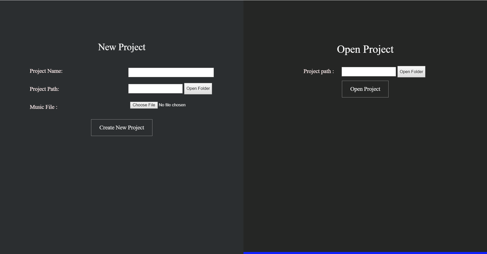
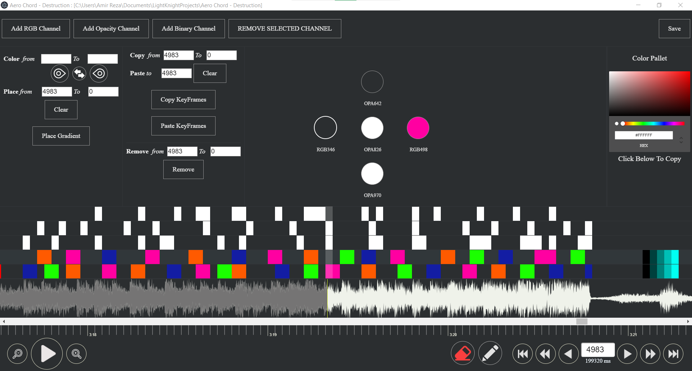

# Light Knight Animator

### How To Run? 
+ Clone this repository 
+ Go into the project directory
+ Open terminal and type `npm install && npm run rebuild`
+ For development environment, run `npm run electron-dev`
+ To build and package, run `npm run electron-pack`

### Keyboard Shortcuts : 
| key          | action                                                 |
| ------------ | ------------------------------------------------------ |
| W            | Select Upper Channel (Change Current Selected Channel) |
| S            | Select Lower Channel (Change Current Selected Channel) |
| 1            | Move Curser Backward By 1 Frame                        |
| 3            | Move Curser Forward By 1 Frame                         |
| 4            | Move Curser Backward By 5 Frame                        |
| 6            | Move Curser Forward By 5 Frame                         |
| 7            | Move Curser Backward By 25 Frame                       |
| 9            | Move Curser Forward By 25 Frame                        |
| Enter        | Place A New Keyframe                                   |
| Space        | Remove A  Keyframe                                     |
| Ctrl + Wheel | Interface Zoom                                         |

### Screenshots 

