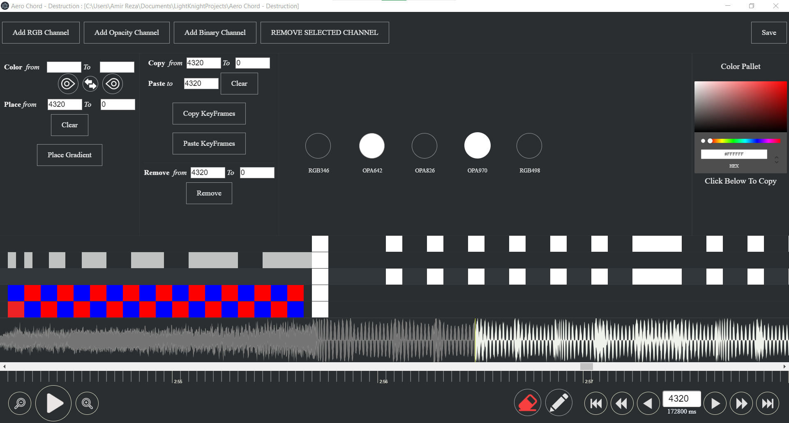

# Light Knight Animator

### How To Run? 
+ clone this repo 
+ go into the project directory
+ open terminal and type `npm install && npm run rebuild`
+ for development environment run `npm run electron-dev`
+ to build and package run `npm run electron-pack`

### Screenshots 

